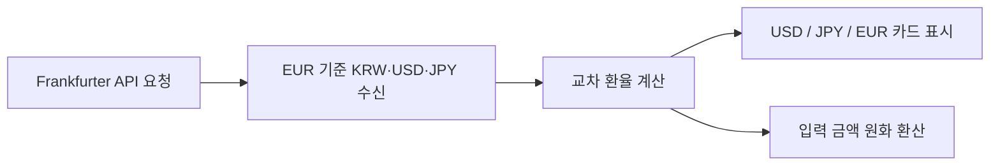
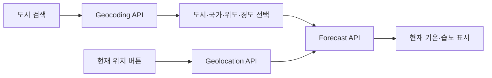

# 박이완의 유니버스

> 배움, 일상, 여행 기록과 JavaScript 인터랙션을 하나의 경험으로 연결한 반응형 개인 웹 허브

<p>
  
  
  
  
  
  
</p>

## 프로젝트 소개

**박이완의 유니버스**는 프로필, 학습 시간표, 휴일 일과, 여행 기록, 회원가입 UI와 JavaScript 실습 기능을 하나의 웹사이트로 연결한 정적 프론트엔드 프로젝트입니다.

단순히 여러 HTML 페이지를 나열하는 데 그치지 않고, 다음 목표를 중심으로 완성도를 높였습니다.

- 공통 브랜드와 내비게이션을 기반으로 한 일관된 사용자 경험
- 실제 데이터를 불러오는 환율·날씨 대시보드
- 날짜와 시간에 반응하는 학습 시간표와 휴일 카드
- 브라우저 기본 창을 대체하는 사이트 전용 모달 UI
- 오디오와 비디오를 사이트 안에 자연스럽게 통합한 커스텀 플레이어
- 입력 상태를 실시간으로 안내하는 회원가입 검증 패널
- 데스크톱, 태블릿, 모바일을 고려한 반응형 레이아웃

현재 프로젝트는 별도의 프레임워크나 빌드 도구 없이 **HTML, CSS, Vanilla JavaScript**만으로 구성되어 있습니다.

---

## 목차

1. [주요 화면](#주요-화면)
2. [핵심 기능](#핵심-기능)
3. [페이지별 상세 기능](#페이지별-상세-기능)
4. [기술적 구현](#기술적-구현)
5. [외부 API와 라이브러리](#외부-api와-라이브러리)
6. [프로젝트 구조](#프로젝트-구조)
7. [실행 방법](#실행-방법)
8. [배포](#배포)
9. [제약 사항](#제약-사항)

---

## 주요 화면

| 페이지 | 역할 | 주요 기능 |
| --- | --- | --- |
| `index.html` | 메인 웹 허브 | 환율, 날씨, JavaScript Lab, 콘텐츠 바로가기 |
| `myClass.html` | 학습 시간표 | 현재 요일·시간·진행 중 수업 자동 강조 |
| `myHoliday.html` | 휴일 일과 | 시간대별 이미지, 현재 시간대 강조, 황새 게임 |
| `myProfile.html` | 개인 프로필 | 관심사, 목표, 핵심 키워드 카드 |
| `myTrip.html` | 여행 아카이브 | 여행 사진, 커스텀 오디오·비디오 플레이어 |
| `signUp.html` | 회원가입 UI | 실시간 입력 검증, 완료율, sticky 진행 패널 |
| `signUpResult.html` | 가입 완료 | 완료 안내, 축하 애니메이션, 페이지 이동 |

---

## 핵심 기능

### 1. SK 스타일 기반 공통 디자인 시스템

프로젝트 전체는 SK를 연상시키는 Red·Orange 계열을 핵심 색상으로 사용하며, Navy와 Teal을 정보 및 완료 상태에 활용합니다.

```css
:root {
  --sk-red: #ea002c;
  --sk-red-dark: #c90026;
  --sk-red-soft: #fff0f3;
  --sk-orange: #f47725;
  --sk-orange-soft: #fff4ec;
  --sk-navy: #0e306d;
  --sk-teal: #009a93;
}
```

공통 디자인 요소는 다음과 같습니다.

- 상단 고정형 글로벌 헤더
- 현재 페이지를 표시하는 `aria-current="page"` 내비게이션
- 공통 Hero와 Page Hero
- Red·Orange 포인트 라인
- 카드, 배지, 버튼, 모달의 공통 시각 언어
- `Noto Sans KR`와 `Montserrat` 조합
- 페이지 진입 시 제목이 위에서 자연스럽게 내려오는 애니메이션
- `prefers-reduced-motion`을 고려한 동작 감소 처리

---

### 2. 반응형 레이아웃

CSS Grid와 Flexbox를 활용해 화면 크기에 따라 레이아웃이 자연스럽게 재구성됩니다.

- 데스크톱: 대시보드, 카드, 폼을 다열 구조로 배치
- 태블릿: 주요 콘텐츠를 1~2열로 재배치
- 모바일: 한 열 구성, 버튼 확장, 가로 스크롤이 필요한 표만 제한적으로 허용
- sticky 요소가 입력이나 콘텐츠를 가리지 않도록 모바일에서 일반 배치로 전환

---

### 3. Progressive Enhancement

JavaScript가 정상 실행되면 향상된 인터랙션을 제공하되, 스크립트가 실패해도 핵심 콘텐츠는 가능한 범위에서 확인할 수 있도록 설계했습니다.

대표적인 예는 여행 페이지의 미디어 플레이어입니다.

- 초기 HTML에는 브라우저 기본 `controls` 유지
- JavaScript 초기화 성공 후 기본 컨트롤 제거
- 사이트 전용 재생 UI 활성화
- JavaScript 실패 시 기본 플레이어를 계속 사용할 수 있음

---

## 페이지별 상세 기능

## 메인 페이지

메인 페이지는 전체 콘텐츠의 진입점이자 실시간 정보와 JavaScript 기능을 제공하는 대시보드입니다.

### 콘텐츠 바로가기

다섯 개의 주요 페이지를 카드 형태로 제공합니다.

- 나의 수업
- 나의 휴일
- 나의 프로필
- 여행 앨범
- 회원가입

각 카드는 hover 시 상단 포인트 라인과 이동 효과가 나타나며, 모바일에서는 한 열로 배치됩니다.

---

### 한국 원화 환율 대시보드

Frankfurter API에서 최신 기준환율을 받아 다음 통화를 원화로 표시합니다.

- 미국 달러 `USD`
- 일본 엔 `JPY`
- 유럽 유로 `EUR`

주요 기능:

- API 로딩 상태 표시
- 환율 기준일 표시
- 수동 새로고침
- 조회 실패 상태 처리
- 입력 금액을 원화로 계산하는 간단 환산기
- 일본 엔은 국내 사용성을 고려해 `100 JPY` 단위로 표시

> 표시되는 값은 초 단위 외환시장 체결가가 아니라 최신 기준환율입니다. 실제 은행 환전 금액과 차이가 있을 수 있습니다.

#### 환율 처리 흐름



---

### 실시간 세계 날씨

Open-Meteo Geocoding API와 Forecast API를 연결해 도시 검색과 현재 위치 날씨를 제공합니다.

주요 기능:

- 도시 이름 검색 모달
- 유사한 도시를 국가·행정구역·좌표와 함께 표시
- 검색 결과 선택
- 브라우저 Geolocation API 기반 현재 위치 조회
- 현재 기온과 습도 표시
- 위치 권한 거절, 타임아웃, API 오류 상태 처리
- 로딩 UI와 접근성을 위한 `aria-live`

#### 날씨 조회 흐름



---

### JavaScript Lab

메인 페이지의 **자바스크립트 천국**에서는 브라우저 기본 `prompt()`와 `alert()` 대신 사이트 전용 공통 모달을 사용합니다.

#### 업다운 게임

- 1부터 50 사이의 난수 생성
- 사용자의 추측 입력
- `Up`, `Down`, 정답 판정
- 도전 횟수 표시
- 취소 및 종료 처리

#### 성적 계산기

- HTML, CSS, JavaScript 점수 입력
- 총점과 평균 계산
- 합격 여부 표시
- 잘못된 점수 범위 검증

#### 내 가방 보기

- 객체가 담긴 배열 순회
- 물품명과 개수 출력
- 총 물품 종류 계산
- 공통 결과 모달로 표시

#### 숫자 야구 게임

규칙:

- 1부터 9 사이의 서로 다른 숫자 세 개
- 숫자와 위치가 모두 같으면 Strike
- 숫자만 같고 위치가 다르면 Ball
- 일치하는 숫자가 없으면 Out
- 3 Strike에서 게임 완료

UX 개선 사항:

- 게임 모달 높이를 일정하게 유지
- 게임 과정과 기록 영역을 2열로 분리
- 시도 기록 영역에만 단일 스크롤 적용
- 최근 기록을 목록 위에 표시
- 모바일에서는 한 열로 재배치
- 정답 시 게임판을 완전히 숨기고 완료 화면으로 전환
- 정답 숫자와 총 시도 횟수 표시
- 새 게임으로 전체 상태 초기화

---

## 학습 시간표 페이지

주간 수업을 표 형식으로 제공하며 브라우저의 현재 날짜와 시간을 기준으로 상태를 자동 표시합니다.

### 현재 요일 강조

오늘이 평일이면 해당 요일의 헤더와 수업 셀을 은은하게 강조합니다.

### 현재 시간 강조

현재 시간이 포함된 행의 시간 셀을 별도로 강조합니다.

### 현재 진행 중인 수업 강조

오늘 요일과 현재 시간이 만나는 수업 셀을 가장 강하게 표시하고 `NOW` 배지를 제공합니다.

### 병합 셀 처리

시간표에는 `rowspan`과 `colspan`이 사용되어 단순한 DOM 셀 인덱스로 현재 수업을 찾기 어렵습니다.

`classSchedule.js`는 표를 논리적인 행·열 Grid로 다시 계산해 병합된 수업도 올바르게 찾습니다.

```text
09:00 월요일 ┐
10:00 월요일 ├─ 같은 Vue.js rowspan 셀
11:00 월요일 ┘
```

### 상태별 안내

- 평일 수업 시작 전
- 현재 진행 중인 수업
- 점심시간
- 수업 종료 후
- 토요일·일요일

시간과 강조 상태는 1분마다 자동으로 갱신됩니다.

> 날짜와 시간 테스트는 운영체제의 시스템 시간을 임시로 변경한 뒤 페이지를 새로고침하는 방식으로 확인할 수 있습니다.

---

## 휴일 페이지

아침, 오후, 저녁 일정을 시간대별 카드로 구성했습니다.

### 시간대별 배경 이미지

각 카드에 다음 이미지를 연결합니다.

- `morning.jpg`
- `afternoon.jpg`
- `night.jpg`

이미지는 `background-size: cover`로 카드 비율에 맞게 잘리며, 기본 상태에서는 숨겨져 있습니다.

카드에 마우스를 올리거나 키보드 포커스가 들어오면 이미지가 매우 희미하게 나타나 텍스트 가독성을 유지합니다.

### 현재 시간대 강조

브라우저 시간을 기준으로 다음 구간을 구분합니다.

| 시간 | 강조 카드 |
| --- | --- |
| 06:00 ~ 11:59 | 아침 |
| 12:00 ~ 17:59 | 오후 |
| 18:00 ~ 05:59 | 저녁 |

현재 시간대 카드에는 테두리, 그림자, `NOW` 배지가 표시됩니다.

### 황새 오래걷기 게임

오후 일정의 `게임 플레이`를 누르면 황새 오래걷기 SWF 게임이 모달에서 실행됩니다.

- Ruffle을 사용한 SWF 실행
- 모달 열기와 닫기
- 다시 시작
- 배경 클릭 닫기
- 기존 페이지 안에서 게임을 실행하는 통합 UX

---

## 프로필 페이지

개인의 관심과 목표를 카드 및 설명 목록으로 제공합니다.

주요 구성:

- 좋아하는 항목
- 올해의 목표
- 관심 분야
- 성격과 가치관을 설명하는 핵심 키워드
- 카드 hover 인터랙션
- 화면 크기에 따른 3열·2열·1열 재배치

프로필 페이지는 다른 실시간 기능과 달리 개인 정보를 명확하고 빠르게 읽을 수 있도록 정적인 정보 구조에 집중했습니다.

---

## 여행 페이지

사진, 음악, 동영상을 하나의 여행 아카이브 안에 통합했습니다.

### 여행 사진 카드

- `figure`와 `figcaption`을 활용한 의미 있는 마크업
- 이미지 lazy loading
- hover 시 이미지 확대 및 채도 변화
- 이미지 하단 그라데이션 캡션
- 모바일 한 열 배치

### 커스텀 오디오 플레이어

브라우저 기본 오디오 플레이어 대신 사이트 스타일의 컨트롤을 제공합니다.

- 재생·일시정지
- 현재 시간과 전체 시간
- 재생 진행 바
- 진행 바를 이용한 탐색
- 음소거
- `READY`, `PLAYING`, `PAUSED`, `ENDED` 상태 표시
- 재생 중 움직이는 파형
- JavaScript 실패 시 기본 `controls` fallback

### 커스텀 비디오 플레이어

동영상을 별도 콘텐츠처럼 붙이는 대신 여행 카드 안에 통합된 미디어 경험으로 구성했습니다.

- 중앙 재생 버튼
- 상단 영상 정보와 재생 상태
- 하단 진행 바와 컨트롤
- 영상 클릭 재생·일시정지
- 음소거
- 전체화면
- 모바일 `playsinline`
- 음악과 영상의 동시 재생 방지
- 영상 재생 중 마우스가 벗어나면 컨트롤 자동 숨김
- 마우스가 다시 올라오면 컨트롤 표시
- 일시정지와 종료 상태에서는 컨트롤 유지
- 터치 환경의 자동 숨김 시간 별도 적용

---

## 회원가입 페이지

실제 서비스의 가입 폼과 유사한 정보 구조와 검증 경험을 구현했습니다.

### 입력 항목

- 아이디
- 비밀번호
- 이메일
- 이름
- 생년월일
- 성별
- 관심 분야
- 가입 경로
- 자기소개
- 이용약관
- 개인정보 처리방침
- 마케팅 정보 수신 여부

### 우측 실시간 검증 패널

데스크톱에서는 검증 패널이 `position: sticky`로 동작해 긴 폼을 내려도 계속 확인할 수 있습니다.

모바일과 태블릿에서는 입력 영역을 방해하지 않도록 폼 위쪽의 일반 카드로 전환됩니다.

검증 상태는 문자 체크 아이콘 대신 색상 점으로 표현합니다.

- 회색 점: 미완료
- Teal 점: 완료

### 필수 항목 검증 조건

| 항목 | 조건 |
| --- | --- |
| 아이디 | 영문·숫자 4~20자 |
| 비밀번호 | 8자 이상, 영문·숫자·특수문자 포함 |
| 이메일 | 앞부분 입력 및 도메인 선택 |
| 이름 | 빈 문자열이 아닌 값 |
| 필수 약관 | 이용약관과 개인정보 처리방침 모두 동의 |

선택 항목은 완료율에 포함하지 않습니다.

### 진행률

필수 항목 완료 수에 따라 0~100% 진행률을 계산합니다.

- 완료 항목 상태 변경
- 남은 필수 항목 수 표시
- 100% 완료 시 진행 바를 Teal 계열로 변경
- 제출 시 첫 미완료 항목으로 포커스 이동

### 정적 프로젝트의 제출 처리

이 프로젝트는 백엔드가 없는 정적 웹 프로젝트입니다.

비밀번호가 GET Query String에 포함되지 않도록 JavaScript가 기본 폼 제출을 차단하고, 모든 필수 검증을 통과한 경우에만 완료 페이지로 이동합니다.

실제 서비스에서는 다음 구성이 필요합니다.

- HTTPS
- 백엔드 회원가입 API
- `POST` 요청
- 서버 측 유효성 검사
- 비밀번호 해시
- 데이터베이스
- CSRF 및 인증 보안

---

## 회원가입 완료 페이지

회원가입 완료 후 사용자가 성공 상태를 명확하게 인지하도록 다음 애니메이션을 제공합니다.

- 완료 카드가 아래에서 부드럽게 나타나는 효과
- 체크 아이콘 확대 애니메이션
- SK Red, Orange, Navy, Teal 컬러의 축하 조각
- 일정 시간이 지나면 생성된 축하 요소 자동 제거
- `prefers-reduced-motion` 사용자는 애니메이션 생략

완료 페이지에서는 메인, 수업, 휴일, 프로필 등 다른 콘텐츠로 바로 이동할 수 있습니다.

---

## 기술적 구현

## HTML

- Semantic HTML5
- `header`, `nav`, `main`, `section`, `article`, `aside`, `footer`
- `figure`, `figcaption`
- `time`
- `fieldset`, `legend`, `label`
- `dialog`
- 접근성을 위한 `aria-live`, `aria-current`, `aria-modal`, `aria-labelledby`
- 폼 `required`, `minlength`, `maxlength`, `pattern`, `autocomplete`

## CSS

- CSS Custom Properties
- Grid / Flexbox
- Responsive Media Queries
- `position: sticky`
- `clamp()`
- `aspect-ratio`
- `backdrop-filter`
- Gradient
- Pseudo Elements
- Custom Range Input
- Keyframe Animation
- `prefers-reduced-motion`
- 상태 클래스 기반 UI
  - `.is-playing`
  - `.is-current`
  - `.is-complete`
  - `.is-controls-hidden`
  - `.is-today-column`
  - `.is-current-class`

## JavaScript

- DOM Query와 Event Listener
- ES Module
- Fetch API
- Async / Await
- URLSearchParams
- Geolocation API
- Fullscreen API
- Intl API
- sessionStorage
- Form Validation
- Array / Object / Set
- 난수 생성 및 Fisher–Yates Shuffle
- Event Delegation
- 동적 DOM 생성
- 모달 상태 관리
- `rowspan`과 `colspan` 논리 Grid 계산
- Progressive Enhancement

---

## 외부 API와 라이브러리

| 서비스 | 용도 | API Key |
| --- | --- | --- |
| Open-Meteo Geocoding API | 도시 이름으로 위치 검색 | 불필요 |
| Open-Meteo Forecast API | 현재 기온·습도 조회 | 불필요 |
| Frankfurter API | 최신 기준환율 조회 | 불필요 |
| Ruffle | SWF 게임 실행 | 불필요 |

### 네트워크 의존 기능

다음 기능은 인터넷 연결이 필요합니다.

- Google Fonts
- 환율 조회
- 날씨 및 도시 검색
- Ruffle CDN 로드

인터넷이 없거나 외부 서비스가 응답하지 않으면 정적 페이지는 표시되지만 해당 기능은 제한될 수 있습니다.

---

## 프로젝트 구조

현재 파일 배치를 기준으로 한 대표 구조입니다.

```text
IWAN-UNIVERSE/
├─ html/
│  ├─ index.html
│  ├─ myClass.html
│  ├─ myHoliday.html
│  ├─ myProfile.html
│  ├─ myTrip.html
│  ├─ signUp.html
│  └─ signUpResult.html
│
├─ css/
│  └─ style.css
│
├─ script/
│  ├─ exchangeInfo.js
│  ├─ realtimeInfo.js
│  ├─ weatherAPI.js
│  ├─ uiModal.js
│  ├─ upDown.js
│  ├─ grade.js
│  ├─ bag.js
│  ├─ baseball.js
│  ├─ classSchedule.js
│  ├─ holiday.js
│  ├─ swfGame.js
│  ├─ travelMedia.js
│  ├─ signUp.js
│  └─ signUpResult.js
│
├─ media/
│  ├─ morning.jpg
│  ├─ afternoon.jpg
│  ├─ night.jpg
│  ├─ music.mp3
│  ├─ video.mp4
│  ├─ walk-the-stork.swf
│  └─ 여행 이미지 파일들
│
└─ README.md
```

---

## 실행 방법

ES Module, 외부 API, 현재 위치 기능을 안정적으로 사용하려면 HTML 파일을 직접 더블클릭하는 `file://` 방식이 아니라 로컬 서버에서 실행해야 합니다.

### VS Code Live Server

1. 프로젝트 폴더를 VS Code로 엽니다.
2. Live Server 확장을 설치합니다.
3. `index.html`을 엽니다.
4. 우측 하단의 **Go Live**를 누릅니다.

### Python 로컬 서버

프로젝트 루트에서 다음 명령을 실행합니다.

```bash
python -m http.server 5500
```

브라우저에서 다음 주소로 접속합니다.

```text
http://localhost:5500/
```

### 저장소를 복제한 경우

```bash
git clone <repository-url>
cd <repository-directory>
python -m http.server 5500
```

별도의 패키지 설치나 빌드 명령은 필요하지 않습니다.

---

## 배포

정적 파일만으로 구성되어 Vercel 서비스에 배포되어 있습니다.

[박이완의 유니버스 바로가기](https://skala-front-neon.vercel.app/html/index.html)

---

## 제약 사항

### 정적 회원가입 데모

현재 회원가입은 실제 계정을 생성하지 않습니다.

- 백엔드 없음
- 데이터베이스 없음
- 로그인 및 인증 없음
- 사용자 정보 영구 저장 없음

프론트엔드 입력 검증과 완료 UX를 보여주기 위한 기능입니다.

### 환율 데이터

환율은 최신 기준환율이며 실시간 거래 가격이 아닙니다.

### 날씨와 위치

- 외부 API 상태에 따라 조회가 실패할 수 있습니다.
- 현재 위치 기능은 사용자의 브라우저 권한이 필요합니다.
- 위치 정확도는 기기와 네트워크 환경에 따라 달라집니다.

### 시간 기반 기능

학습 시간표와 휴일 카드는 사용자의 기기 날짜와 시간을 기준으로 동작합니다. 시스템 시간이 잘못 설정되어 있으면 강조 상태도 실제 시간과 다르게 표시됩니다.

### SWF 게임

황새 게임은 Ruffle의 브라우저 호환 범위와 SWF 파일 상태에 영향을 받습니다.

---

## 라이선스

이 저장소는 개인 학습, 프로젝트 제출 및 포트폴리오 목적으로 제작되었습니다.

별도의 `LICENSE` 파일이 없으며, 소스 코드와 미디어 자산의 재사용 범위는 프로젝트 작성자에게 문의해야 합니다.

---

## 작성자

**박이완**

- Project: 박이완의 유니버스
- Type: Responsive Static Web Project
- Stack: HTML5, CSS3, Vanilla JavaScript
